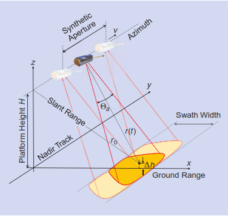
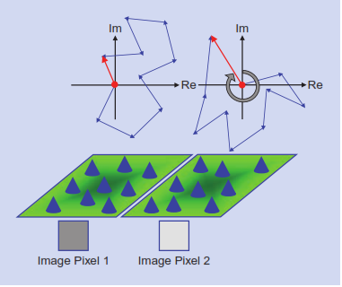
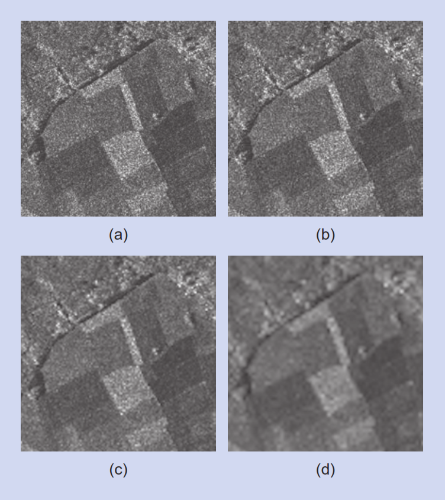
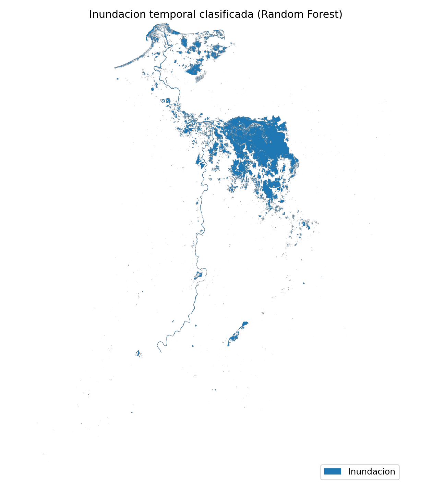
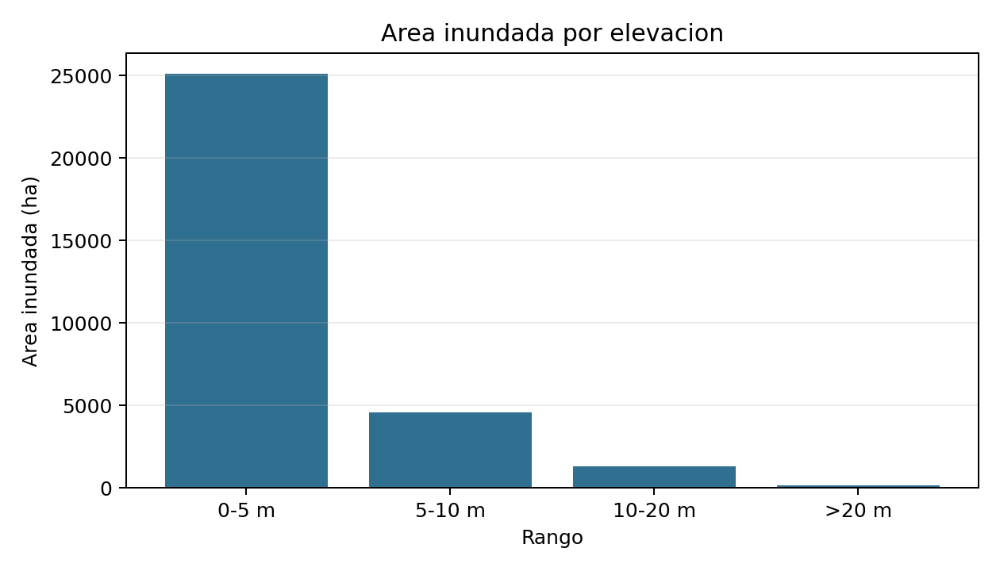
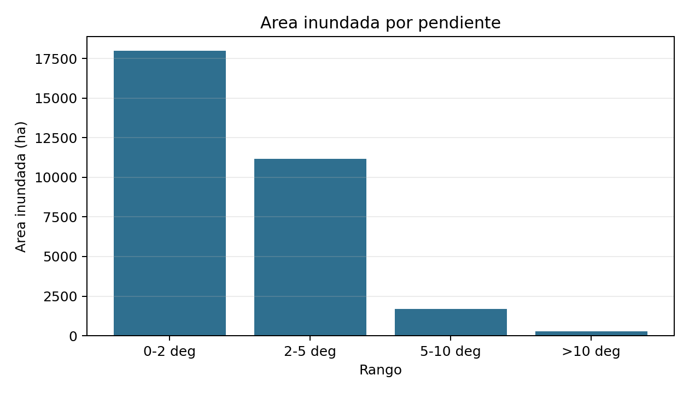
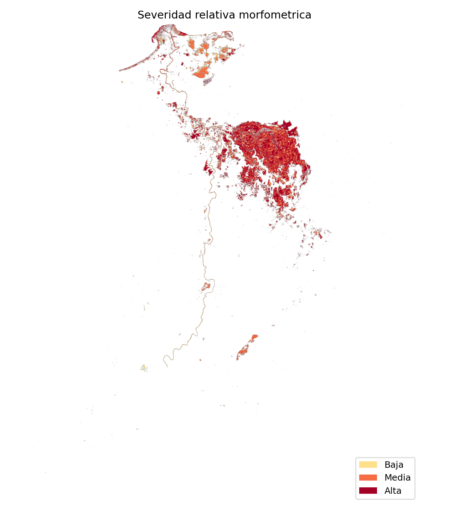
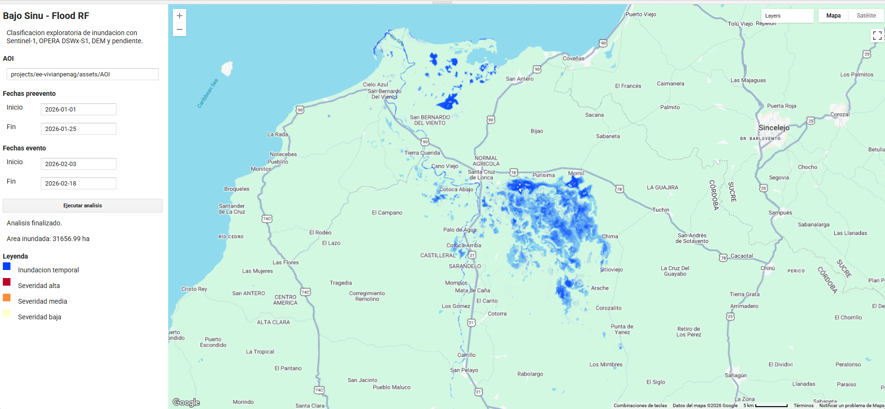
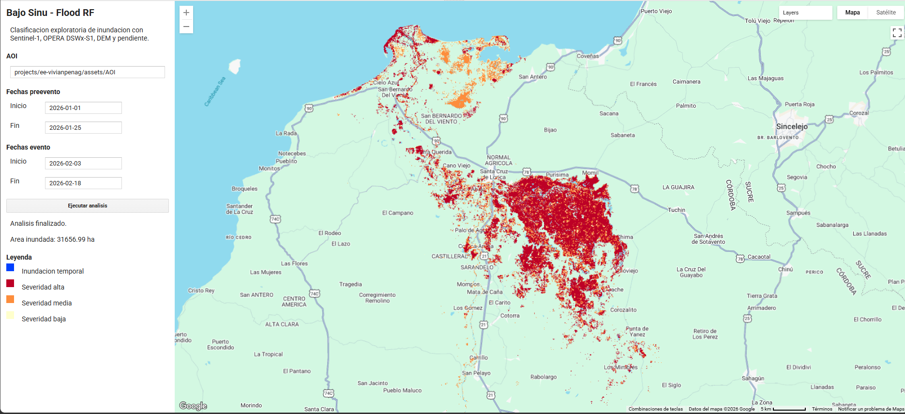

\newpage

# Introducción y justificación

Las inundaciones constituyen uno de los fenómenos hidrológicos con alto impacto territorial, social y ambiental en Colombia, especialmente en zonas con alta dinámica fluvial, ocupación de planicies de inundación y exposición de actividades humanas e infraestructura. En el departamento de Córdoba, el comportamiento del río Sinú ha generado afectaciones sobre áreas rurales y urbanas, por lo que el análisis espacial de este fenómeno resulta pertinente tanto desde una perspectiva territorial como metodológica.

En el marco de esta problemática, la **Subzona Hidrográfica del Bajo Sinú** representa una unidad espacial adecuada para estudiar la distribución de áreas inundadas, ya que concentra procesos hidrológicos relevantes de la parte baja de la cuenca y ofrece una delimitación más precisa que analizar la cuenca completa. 

El uso de imágenes **Sentinel-1** es pertinente porque este sensor radar puede captar información de la superficie terrestre incluso en condiciones de nubosidad, una ventaja importante en eventos hidrometeorológicos. La literatura muestra que Sentinel-1 ha sido utilizado con éxito en cartografía rápida de inundaciones y en flujos automáticos de análisis con niveles de precisión aceptables [@li2018; @alexandre2020].

Por otra parte, el algoritmo **Random Forest** constituye una alternativa metodológica adecuada para este trabajo, debido a su capacidad para manejar múltiples variables de entrada y su utilidad en problemas de clasificación de inundaciones con imágenes de percepción remota. Su complejidad es intermedia y compatible con el tiempo disponible, sin sacrificar rigurosidad analítica [@billah2023].

Además del interés territorial del caso, el proyecto aporta un flujo reproducible de cartografía de inundaciones que integra variables SAR, información topográfica, una referencia satelital auxiliar y documentación programática. De esta manera, el énfasis no se limita al producto cartográfico final, sino también a la construcción de una cadena de procesamiento replicable.

Con el fin de mantener un alcance viable, el proyecto se enfocó en **un único evento reciente de inundación** dentro de la Subzona Hidrográfica del Bajo Sinú, utilizando un número limitado de fechas e implementando un flujo reproducible en **Google Earth Engine y Python**. Este enfoque permitió desarrollar un producto técnicamente sólido, coherente con el curso y factible dentro de un periodo de cuatro semanas. Además, el uso de Google Earth Engine fortaleció el componente de reproducibilidad y facilitó el procesamiento de imágenes satelitales en la nube [@gorelick2017].

# Marco teórico

## Radar de apertura sintética

El radar de apertura sintética, conocido como **SAR** por sus siglas en inglés, es una tecnología activa de percepción remota que transmite pulsos electromagnéticos hacia la superficie terrestre y registra los ecos retrodispersados por los objetos presentes en la escena. A diferencia de los sensores ópticos pasivos, los sistemas SAR no dependen de la iluminación solar y pueden adquirir información durante el día o la noche. Además, por operar en longitudes de onda de microondas, ofrecen una capacidad importante para adquirir imágenes bajo condiciones de nubosidad, lo que los hace especialmente útiles para monitorear procesos dinámicos de la superficie terrestre [@moreira2013].

El principio de apertura sintética permite construir una antena virtual a partir del desplazamiento de la plataforma y del procesamiento coherente de múltiples ecos recibidos. De esta manera, el sistema genera una imagen de alta resolución que representa la reflectividad o retrodispersión de la escena observada. En términos generales, las áreas con alta retrodispersión aparecen como valores más intensos, mientras que superficies lisas que reflejan la energía fuera de la dirección del sensor tienden a presentar baja retrodispersión [@moreira2013].

En el caso de Sentinel-1, el uso de SAR es compatible con el objetivo de mapear inundaciones porque permite observar condiciones de la superficie durante o después de eventos de lluvia, incluso cuando la nubosidad limita sensores ópticos.

Sentinel-1 opera en **banda C**, una región de microondas adecuada para observar cambios superficiales a escalas compatibles con el monitoreo ambiental. Su respuesta no depende únicamente de la presencia o ausencia de agua: también está controlada por la rugosidad, la humedad, la permitividad dieléctrica, el ángulo de incidencia y la geometría local del terreno. En superficies lisas, como agua abierta con poco viento, puede predominar una reflexión especular que reduce el retorno hacia el sensor; en cambio, vegetación, suelo húmedo, oleaje o estructuras urbanas pueden producir respuestas más intensas o ambiguas [@moreira2013].

De forma general, la respuesta radar de una superficie suele representarse mediante el coeficiente de retrodispersión $\sigma^0$. Cuando se trabaja en decibeles, se expresa como:

$$
\sigma^0_{dB} = 10 \log_{10}(\sigma^0)
$$

En términos interpretativos, valores bajos de retrodispersión suelen asociarse con superficies lisas, como agua abierta, mientras que valores más altos tienden a relacionarse con vegetación, rugosidad superficial o estructuras que devuelven mayor energía al sensor.

{width=55%}


## Geometría de adquisición, retrodispersión y superficies de agua

La señal SAR registrada depende de la interacción entre el pulso emitido y las propiedades físicas y eléctricas de la superficie. Entre los factores más relevantes se encuentran la geometría del objeto, la rugosidad superficial, la humedad, la constante dieléctrica y la longitud de onda empleada por el sensor. Moreira et al. [-@moreira2013] señalan que la amplitud y la fase de la señal retrodispersada dependen de propiedades físicas como geometría y rugosidad, así como de propiedades eléctricas como la permitividad.

Esta relación es central para la detección de inundaciones. Las superficies de agua abierta suelen comportarse como superficies relativamente lisas frente al radar, por lo que reflejan la energía en dirección especular y devuelven poca señal al sensor. Como resultado, en imágenes SAR las áreas inundadas o cuerpos de agua pueden aparecer con valores bajos de retrodispersión. Sin embargo, esta respuesta puede variar en presencia de vegetación inundada, zonas urbanas, sombras radar, rugosidad inducida por viento o mezclas de agua y cobertura terrestre.

La geometría lateral de adquisición propia del SAR también introduce efectos como sombra, acortamiento y layover en áreas con relieve o estructuras verticales [@moreira2013]. Aunque el Bajo Sinú corresponde principalmente a una zona de baja pendiente, estos elementos son relevantes para interpretar posibles errores o ambigüedades en la clasificación, especialmente en áreas urbanas o con vegetación.

## Speckle, multilooking y filtros SAR

El speckle es una característica propia de la imagen SAR coherente. Se produce por la suma de muchas respuestas elementales dentro de una misma celda de resolución, cuyas fases y amplitudes generan fluctuaciones fuertes entre píxeles vecinos. Aunque suele tratarse como ruido visual, no corresponde a un ruido aditivo simple, sino a un efecto asociado a la naturaleza coherente de la medición SAR [@moreira2013].

Para reducir este efecto se emplean técnicas como multilooking o filtros espaciales. Estas operaciones mejoran la interpretabilidad de la imagen, pero implican una pérdida o suavizado de detalle espacial. En este proyecto se asume esa limitación: la reducción de ruido puede estabilizar la clasificación, pero también puede eliminar señales pequeñas o lineales de inundación ribereña.

En forma simplificada, el multilook puede entenderse como un promedio no coherente de varias observaciones parciales:

$$
I_{ML} = \frac{1}{L} \sum_{k=1}^{L} I_k
$$

Donde $I_{ML}$ es la intensidad multilook, $I_k$ es cada observación parcial y $L$ es el número de looks. A mayor número de looks, menor efecto visual del speckle, pero también menor detalle espacial.

{width=60%}

{width=60%}


## Polarización y variables SAR para inundaciones

Los sistemas SAR pueden transmitir y recibir señales con diferentes polarizaciones. En Sentinel-1, las polarizaciones VV y VH permiten observar respuestas distintas de la superficie. La polarización VV puede ser sensible a superficies abiertas y cambios de rugosidad, mientras que VH puede aportar información relacionada con dispersión volumétrica o interacción con vegetación.

Por esta razón, el proyecto utiliza bandas VV y VH en dos momentos temporales: preevento y evento. A partir de ellas se derivan diferencias temporales y relaciones entre polarizaciones. Estas variables permiten representar cambios de retrodispersión asociados al paso de una condición previa a una condición posiblemente inundada.

Las variables derivadas usadas en el proyecto pueden expresarse de forma general como:

$$
\Delta VV = VV_{evento} - VV_{pre}
$$

$$
\Delta VH = VH_{evento} - VH_{pre}
$$

$$
R_{VV-VH} = VV_{evento} - VH_{evento}
$$

Si las bandas ya están en dB, estas diferencias se interpretan directamente como cambios relativos de retrodispersión entre fechas y polarizaciones.

## Detección de cambios con SAR

La detección de cambios con SAR compara una imagen de referencia, usualmente preevento, con una imagen objetivo durante o después del evento. En cartografía de inundaciones, esta estrategia ayuda a distinguir cambios asociados al evento frente a cuerpos de agua permanentes o respuestas estables. Li et al. [-@li2018] indican que estos métodos requieren imágenes comparables en sensor, órbita, polarización y cobertura, porque las diferencias geométricas o radiométricas pueden afectar el resultado.

En términos operativos, la detección puede hacerse mediante diferencia, razón o log-ratio entre imágenes. En este proyecto, la lógica de cambio se incorpora dentro del stack de predictores del Random Forest, mediante variables como diferencia temporal de VV y diferencia temporal de VH.

Una forma alternativa de expresar la detección de cambio es mediante la razón o log-ratio:

$$
LR = \log \left( \frac{\sigma^0_{evento}}{\sigma^0_{pre}} \right)
$$

Aunque el proyecto no clasificó con un umbral único sobre $LR$, esta expresión resume la lógica física detrás de la comparación temporal de escenas SAR.


## Clasificación supervisada y severidad relativa

Random Forest es un algoritmo de clasificación supervisada basado en un conjunto de árboles de decisión. Cada árbol se entrena con subconjuntos aleatorios de muestras y variables, y la clasificación final se obtiene mediante votación. Esta estructura permite manejar múltiples predictores y reduce la dependencia de un único umbral.

Belgiu y Dragut [-@belgiu2016rf] señalan que Random Forest es usado en percepción remota por su capacidad para manejar alta dimensionalidad y multicolinealidad, además de requerir pocos parámetros en comparación con otros clasificadores. Sin embargo, también advierten que el método es sensible al diseño de muestreo. Por ello, en este proyecto las métricas se interpretan como evaluación frente a una referencia satelital auxiliar, no como validación de campo.

Para el reporte de desempeño se usaron métricas básicas de clasificación, especialmente exactitud global y coeficiente kappa:

$$
OA = \frac{VP + VN}{N}
$$

$$
\kappa = \frac{p_o - p_e}{1 - p_e}
$$

Donde $VP$ son verdaderos positivos, $VN$ verdaderos negativos, $N$ el total de muestras, $p_o$ el acuerdo observado y $p_e$ el acuerdo esperado por azar.

## Severidad relativa morfométrica

La severidad relativa propuesta no corresponde a una modelación hidráulica. Se entiende como una interpretación morfométrica dentro de la máscara final de inundación temporal. En este sentido, las áreas inundadas ubicadas en baja elevación y baja pendiente se interpretan como zonas con mayor favorabilidad topográfica para acumulación o permanencia de agua.

Esta aproximación permite incorporar el DEM y la pendiente al análisis sin ampliar el alcance hacia estimación de profundidad, volumen, velocidad o amenaza hidráulica formal. El resultado debe leerse como una clasificación exploratoria del patrón espacial detectado.

De manera conceptual, la regla empleada puede resumirse así:

$$
S(x) = f\left(I(x), E(x), P(x)\right)
$$

con los siguientes criterios:

- Alta: si el píxel pertenece a la inundación temporal y además se ubica en baja elevación ($E<5$ m) y baja pendiente ($P<2^\circ$).
- Media: si el píxel pertenece a la inundación temporal y solo cumple una de las dos condiciones anteriores.
- Baja: si el píxel pertenece a la inundación temporal, pero no cumple ninguna de las dos condiciones anteriores.

Donde $I(x)$ indica si el píxel pertenece a la máscara de inundación temporal, $E(x)$ es la elevación y $P(x)$ la pendiente.

# Estado del arte

La cartografía de inundaciones mediante teledetección ha sido ampliamente desarrollada en las últimas décadas debido a la necesidad de identificar de manera rápida y confiable la extensión espacial de eventos extremos. En este campo, los sensores radar de apertura sintética (SAR) han adquirido una relevancia especial porque pueden operar independientemente de la cobertura nubosa y de la iluminación solar, condiciones que suelen limitar el uso de imágenes ópticas durante episodios de inundación.

En particular, la misión **Sentinel-1** ha demostrado ser una fuente útil para estudios de inundación gracias a su resolución espacial, disponibilidad abierta y frecuencia de adquisición. Li et al. propusieron un enfoque automático de detección de cambio en datos Sentinel-1 para cartografía rápida de inundaciones, con resultados cercanos al 95% de exactitud global y un coeficiente kappa de 0.75, destacando la simplicidad, velocidad y reproducibilidad del método [@li2018]. Asimismo, Alexandre et al. mostraron que las cadenas de procesamiento automatizadas con Sentinel-1 y Python son confiables y relativamente simples de implementar en problemas de análisis de inundaciones [@alexandre2020].

Además de los métodos automáticos basados en umbrales o detección de cambio, la literatura también ha explorado la integración de algoritmos de aprendizaje automático. Entre ellos, **Random Forest** se ha utilizado con resultados positivos para clasificación de coberturas y evaluación de daños por inundación a partir de imágenes Sentinel, mostrando ventajas en precisión y aplicabilidad operativa [@billah2023].

En paralelo, las plataformas de computación en la nube han ampliado la escala y reproducibilidad de los análisis espaciales. **Google Earth Engine** se ha consolidado como una herramienta central para el procesamiento de grandes volúmenes de imágenes satelitales, ya que ofrece un catálogo amplio de datos, funciones integradas y acceso mediante JavaScript y Python. Gorelick et al. destacan que esta plataforma fue diseñada para facilitar análisis geoespaciales a escala planetaria y promover flujos de trabajo reproducibles sin depender del hardware local del usuario [@gorelick2017].

## Sistemas de alerta temprana y productos satelitales para inundaciones

El análisis de inundaciones mediante sensores remotos no solo tiene utilidad cartográfica posterior al evento, sino que también puede integrarse en flujos más amplios de monitoreo, respuesta rápida y alerta temprana. NASA Lifelines recopila recursos orientados a la construcción de flujos de alerta por inundación, incluyendo tableros operativos, productos satelitales de monitoreo casi en tiempo real, series históricas, guías metodológicas y estudios de caso [@nasa_lifelines_2026].

Entre los recursos destacados se encuentran sistemas como Google Flood Hub, GloFAS y GFMS; datos de precipitación GPM IMERG; productos de extensión de inundación casi en tiempo real derivados de VIIRS y MODIS; y productos radar como OPERA DSWx-S1 para confirmar agua superficial bajo nubosidad o durante la noche. Estas fuentes cumplen funciones distintas: algunas se orientan al pronóstico fluvial, otras al monitoreo de precipitación y otras a la observación de agua superficial. Su aplicabilidad local depende de la escala, la resolución espacial, la disponibilidad temporal y la validación con información complementaria.

Aunque el presente proyecto no desarrolla un sistema operacional de alerta temprana, sí se relaciona con esta lógica práctica porque genera una cadena reproducible para identificar la extensión espacial de áreas probablemente inundadas. La integración de Sentinel-1 SAR, OPERA DSWx-S1, DEM, pendiente y procesamiento en Google Earth Engine puede aportar insumos para diagnósticos rápidos, contraste de reportes institucionales, priorización de zonas afectadas y análisis posterior al evento, sin reemplazar sistemas hidrológicos de pronóstico ni modelaciones de profundidad o volumen de agua.

De manera complementaria, revisiones recientes sobre integración de percepción remota y aprendizaje automático en estudios de inundación muestran que modelos como Random Forest, SVM y redes neuronales han sido ampliamente utilizados y presentan desempeños adecuados en contextos diversos, lo cual refuerza la vigencia del enfoque propuesto [@manyaka2026].

En conjunto, la revisión indica que existe respaldo metodológico suficiente para un proyecto basado en cuatro ideas centrales: uso de Sentinel-1 para la detección de inundaciones, clasificación supervisada con Random Forest, automatización parcial del flujo de trabajo y documentación reproducible en entornos programáticos.

# Objetivos

## Objetivo general

Analizar la distribución espacial de áreas inundadas asociadas a un evento reciente en la Subzona Hidrográfica del Bajo Sinú mediante imágenes Sentinel-1 y un modelo Random Forest, a partir de un flujo reproducible implementado en Google Earth Engine y Python.

## Objetivos específicos

1. Identificar y procesar imágenes Sentinel-1 y capas auxiliares pertinentes para la detección de áreas inundadas en la Subzona Hidrográfica del Bajo Sinú durante un evento reciente.

2. Implementar y evaluar un modelo Random Forest para clasificar áreas inundadas y no inundadas, generando cartografía temática y métricas básicas del evento analizado.

3. Cuantificar el área inundada y analizar su distribución por rangos de elevación y pendiente, con el fin de construir una aproximación de severidad relativa morfométrica del evento.

# Área de estudio

El área de estudio corresponde a la **Subzona Hidrográfica del Bajo Sinú**, ubicada en el departamento de Córdoba, Colombia. Esta delimitación proporciona una unidad territorial más manejable que la cuenca completa del río Sinú, lo cual apoya tanto la interpretación espacial como la viabilidad operativa del proyecto.

La elección de esta subzona responde a dos criterios principales. El primero es su pertinencia territorial, dado que el tramo bajo del río Sinú presenta condiciones propicias para la ocurrencia de inundaciones por su dinámica fluvial y por la presencia de áreas bajas y planicies susceptibles al anegamiento. El segundo es la factibilidad analítica, ya que trabajar sobre una subzona específica permite controlar de manera efectiva el volumen de datos, seleccionar un evento concreto, reducir el tiempo de procesamiento y simplificar la construcción de muestras de entrenamiento y validación.

La delimitación final del polígono se realizó a partir de información geográfica en formato vectorial, posteriormente convertida a GeoJSON para su integración al flujo reproducible del proyecto. El mapa de localización incluido en esta sección sirve como referencia espacial del área de análisis.

```{python}
#| label: fig-area-estudio
#| fig-cap: "Área de estudio: Subzona Hidrográfica del Bajo Sinú, departamento de Córdoba."
#| out-width: "55%"
import geopandas as gpd
import matplotlib.pyplot as plt

# Leer capas
dptos = gpd.read_file("data/vector/processed/depto.geojson")
aoi = gpd.read_file("data/vector/processed/bajo_sinu.geojson")

# Unificar CRS si hace falta
if dptos.crs is not None and dptos.crs.to_string() != "EPSG:4326":
    dptos = dptos.to_crs(epsg=4326)

if aoi.crs is not None and aoi.crs.to_string() != "EPSG:4326":
    aoi = aoi.to_crs(epsg=4326)

# Filtrar Córdoba
cordoba = dptos[dptos["DeNombre"].str.upper().str.contains("CORDOBA|CÓRDOBA", na=False)]

# Crear mapa
fig, ax = plt.subplots(figsize=(5, 6.5))

dptos.plot(ax=ax, color="whitesmoke", edgecolor="gray", linewidth=0.4)
cordoba.plot(ax=ax, color="lightyellow", edgecolor="black", linewidth=1.0)
aoi.plot(ax=ax, color="deepskyblue", edgecolor="black", linewidth=1.0)

ax.set_title("Subzona Hidrográfica del Bajo Sinú", fontsize=11)
ax.set_xlabel("Longitud")
ax.set_ylabel("Latitud")
ax.grid(True, linestyle="--", alpha=0.3)

plt.tight_layout()
plt.show()
```

# Fuentes de datos

El proyecto se apoyó en fuentes de datos abiertas y reproducibles, seleccionadas según su utilidad directa para la detección de áreas inundadas.

| Fuente | Tipo de dato | Resolución / escala | Periodo | Uso dentro del proyecto |
|---|---|---:|---|---|
| Sentinel-1 SAR GRD | Ráster SAR | 10 m nativo; análisis a 30 m | Ene-feb 2026 | VV/VH preevento y evento |
| OPERA DSWx-S1 | Agua superficial | 30 m | Evento | Referencia auxiliar para muestreo |
| NASADEM | Elevación | 30 m | Estático | DEM para análisis topográfico |
| `ee.Terrain.slope()` | Pendiente | 30 m | Derivado | Variable de severidad relativa |
| JRC Global Surface Water | Agua permanente | 30 m | Serie histórica | Máscara por `occurrence` |
| AOI Bajo Sinú | Vector | Subzona hidrográfica | Local | Área de estudio y recorte |
| GEE, Python, Julia y Quarto | Entorno | No aplica | Reproducible | Procesamiento y documentación |


# Metodología

## Evento, ventanas temporales y predictores

El análisis se enfocó en un evento de creciente del río Sinú ocurrido durante febrero de 2026. Para representar la condición previa al evento se utilizó una ventana entre el 1 y el 25 de enero de 2026, con 19 escenas Sentinel-1. Para la condición del evento se utilizó la ventana entre el 3 y el 18 de febrero de 2026, con 11 escenas Sentinel-1.

El compuesto preevento se calculó mediante mediana temporal, mientras que el compuesto del evento se calculó con el valor mínimo de retrodispersión. Esta decisión permitió capturar píxeles que presentaron baja retrodispersión en alguna escena dentro de la ventana de inundación, evitando que una mediana temporal suavizara señales breves o localizadas.

Para mantener una base de comparación homogénea, las colecciones preevento y evento se filtraron sobre la misma área de estudio, el modo de adquisición `IW` y la disponibilidad simultánea de las polarizaciones `VV` y `VH`. Los compuestos temporales también reducen la dependencia de una única escena y parte de la variabilidad local asociada al speckle. No obstante, el flujo no restringió explícitamente la dirección orbital ni el número de órbita relativa, por lo que diferencias residuales en la geometría de observación pueden contribuir a algunos cambios de retrodispersión.

El stack de predictores usado por el modelo Random Forest incluyó nueve bandas: VV y VH preevento, VV y VH del evento, diferencia temporal de VV, diferencia temporal de VH, relación VV-VH del evento, elevación y pendiente. La elevación se obtuvo de NASADEM y la pendiente se derivó mediante `ee.Terrain.slope()`.

En notación resumida, el stack puede escribirse como:

$$
X = [VV_{pre}, VH_{pre}, VV_{evento}, VH_{evento}, \Delta VV, \Delta VH, R_{VV-VH}, DEM, Slope]
$$

## Muestras y clasificación Random Forest

Las muestras de entrenamiento y validación se construyeron con apoyo de OPERA DSWx-S1, usando la banda `BWTR_Binary_water`. Este producto se empleó como referencia auxiliar de agua/no agua durante la ventana del evento. Se generaron 1800 muestras estratificadas: 1281 para entrenamiento y 519 para validación.

El modelo se implementó en Google Earth Engine mediante `ee.Classifier.smileRandomForest`, con 200 árboles, población mínima de hoja igual a 3 y fracción de bolsa igual a 0.7.

## Verificación local en Python y resumen en Julia

Con el fin de mantener la coherencia con el planteamiento inicial del proyecto, las muestras exportadas desde Google Earth Engine también se usaron para entrenar un Random Forest local en Python mediante `scikit-learn`. Esta verificación no reemplaza el mapa generado en GEE, ya que el procesamiento espacial y la clasificación sobre el raster completo se realizaron en la nube. Sin embargo, permite comprobar que el comportamiento del modelo es reproducible a partir de las muestras exportadas.

Adicionalmente, se preparó un resumen de postproceso en Julia usando `CSV.jl` y `DataFrames.jl`. Este paso no buscó reemplazar la clasificación principal, sino mostrar que las salidas tabulares del proyecto pueden ser leídas y resumidas en otro lenguaje dentro del mismo entorno reproducible.

## Distinción entre agua del evento e inundación temporal

El Random Forest entrenado con OPERA DSWx-S1 clasifica inicialmente píxeles de agua y no agua observados durante el evento. Esta salida puede incluir cuerpos de agua permanentes, ciénagas y humedales, por lo que no equivale directamente a una máscara de inundación temporal.

Para aproximar la inundación temporal, se excluyeron píxeles de agua permanente usando `JRC/GSW1_4/GlobalSurfaceWater`, banda `occurrence`, con un umbral de 95%. También se evaluó un filtro de conectividad de 8 píxeles conectados para reducir ruido espacial, pero no se aplicó al producto final porque eliminaba patrones pequeños y lineales potencialmente asociados con inundación ribereña o urbana, especialmente cerca de Montería.

El cálculo del área se resume con:

$$
A_{ha} = \frac{N_{pix} \cdot r^2}{10\,000}
$$

Donde $N_{pix}$ es el número de píxeles clasificados como inundación y $r$ es la resolución espacial en metros. Para Sentinel-1 remuestreado a 30 m, cada píxel equivale a 900 m$^2$ o 0.09 ha.

## Productos de salida

Las salidas finales del proyecto se generaron mediante scripts en Google Earth Engine y Python. Los productos principales corresponden a: i) un ráster de inundación temporal clasificada, ii) un ráster de severidad relativa morfométrica, iii) una tabla de métricas del modelo Random Forest, iv) una tabla de área inundada total y v) tablas de distribución del área inundada por rangos de elevación y pendiente.

Dado el enfoque de Programación SIG, se priorizó que las salidas fueran generadas por código, evitando depender de procesos manuales para producir resultados intermedios y finales. Esta decisión permite repetir el flujo con ajustes mínimos sobre nuevas ventanas temporales o sobre otra delimitación espacial, siempre que se mantengan disponibles las fuentes de datos utilizadas.

El flujo metodológico general puede resumirse así:

```text
AOI Bajo Sinú + evento seleccionado
        ↓
Sentinel-1 preevento/evento + NASADEM + pendiente + OPERA DSWx-S1 + JRC GSW
        ↓
Construcción de predictores SAR y topográficos
        ↓
Muestreo estratificado agua/no agua y separación entrenamiento/validación
        ↓
Entrenamiento Random Forest en Google Earth Engine
        ↓
Clasificación inicial de agua del evento
        ↓
Exclusión de agua permanente y evaluación de conectividad
        ↓
Inundación temporal clasificada
        ↓
Área inundada, distribución topográfica y severidad relativa
        ↓
Mapas, tablas, métricas, apps GEE e informe reproducible en Quarto
```

# Resultados

En esta sección se presentan los productos principales generados por el flujo reproducible implementado en Google Earth Engine, Python, Julia y Quarto. Primero se reporta la evaluación del clasificador Random Forest a partir de la referencia auxiliar utilizada; después se muestran los resultados cartográficos de la inundación temporal clasificada, las estimaciones de área y su distribución por rangos de elevación y pendiente. Finalmente, se presenta la severidad relativa morfométrica como producto complementario de interpretación espacial, aclarando su carácter exploratorio y no hidráulico.

## Evaluación del modelo Random Forest

La evaluación frente a OPERA DSWx-S1 produjo una exactitud global de 0.859 y un coeficiente kappa de 0.719.

| Referencia / clasificación | No agua | Agua |
|---|---:|---:|
| No agua | 225 | 28 |
| Agua | 45 | 221 |

El coeficiente kappa se reporta como métrica complementaria por su uso frecuente en clasificación de imágenes. Sin embargo, la interpretación principal se basa en la matriz de confusión y en las precisiones por clase, dado que OPERA DSWx-S1 se utiliza como referencia auxiliar y no como verdad de campo.

Con la matriz anterior, la exactitud global se calcula como:

$$
OA = \frac{225 + 221}{519} = 0.859
$$

Además de la exactitud global, se calcularon métricas específicas para la clase agua, que es la categoría de mayor interés para este proyecto. La precisión de usuario para agua fue de 0.888, la sensibilidad o precisión de productor fue de 0.831 y el F1-score aproximado fue de 0.858. Estos valores indican una capacidad adecuada para detectar superficies inundadas, aunque persisten errores de omisión y comisión asociados a la complejidad radiométrica de algunas coberturas, bordes de agua, vegetación inundada o superficies con baja retrodispersión.

## Resultados de la verificación local en Python y el resumen en Julia

La comparación entre la implementación en Google Earth Engine y la implementación local en Python mostró resultados muy similares:

| Implementación | Exactitud global | Kappa | Muestras | Entrenamiento | Validación |
|---|---:|---:|---:|---:|---:|
| GEE `smileRandomForest` | 0.859 | 0.719 | 1800 | 1281 | 519 |
| Python `scikit-learn` | 0.859 | 0.719 | 1800 | 1281 | 519 |

En Python, la matriz de confusión local fue:

| Referencia / clasificación | No agua | Agua |
|---|---:|---:|
| No agua | 219 | 34 |
| Agua | 39 | 227 |

La importancia de variables estimada por el modelo local indicó que la elevación fue el predictor de mayor peso, seguida por las bandas SAR del evento, especialmente VH y VV. La contribución de la elevación (34.3%) indica que la topografía fue un factor determinante para diferenciar áreas con mayor probabilidad de inundación en el Bajo Sinú. Este resultado es coherente con la dinámica de las planicies aluviales, donde pequeñas variaciones altitudinales pueden condicionar la acumulación temporal de agua. La presencia de VH y VV del evento entre las variables más importantes confirma, a su vez, el valor de la información SAR para identificar cambios asociados a superficies inundadas.

| Variable | Importancia Python RF |
|---|---:|
| Elevación | 0.343 |
| VH evento | 0.175 |
| VV preevento | 0.109 |
| VV evento | 0.107 |
| VH preevento | 0.074 |
| Relación VV-VH evento | 0.059 |
| Diferencia VH evento-preevento | 0.056 |
| Diferencia VV evento-preevento | 0.039 |
| Pendiente | 0.036 |

El script en Julia confirmó los principales valores de salida del flujo: área inundada final de 31103.13 ha, exactitud global de GEE de 0.859, kappa de 0.719, 1800 muestras totales, 1281 de entrenamiento y 519 de validación. También recuperó los porcentajes principales del análisis topográfico: 80.69% del área inundada entre 0 y 5 m de elevación y 57.80% en pendientes entre 0 y 2 grados.

## Área de inundación temporal

| Producto | Área (ha) |
|---|---:|
| Agua del evento cruda | 110075.63 |
| Sin agua permanente | 31103.13 |
| Con filtro de conectividad | 30175.94 |
| Producto final de inundación temporal | 31103.13 |



## Distribución por elevación y pendiente

La mayor parte del área inundada se concentró en rangos bajos de elevación. El 80.69% del área clasificada como inundación temporal se ubicó entre 0 y 5 m, y el 14.68% entre 5 y 10 m. Esto es consistente con la dinámica esperada en planicies bajas asociadas al río Sinú.



En relación con la pendiente, el 57.80% del área inundada se ubicó en pendientes entre 0 y 2 grados, mientras que el 35.86% se encontró entre 2 y 5 grados. Esto refuerza la interpretación de que la inundación detectada se concentra principalmente en zonas de baja pendiente.



## Severidad relativa

La severidad relativa se construyó únicamente dentro de la máscara final de inundación temporal. Las categorías no representan profundidad, volumen ni amenaza hidráulica, sino una lectura morfométrica basada en la combinación entre inundación detectada, elevación y pendiente.



| Clase | Criterio conceptual | Interpretación |
|---|---|---|
| Alta | Inundación en baja elevación y baja pendiente | Mayor favorabilidad topográfica para acumulación o permanencia de agua |
| Media | Inundación con una de las dos condiciones anteriores | Condición morfométrica intermedia |
| Baja | Inundación en mayor elevación relativa o mayor pendiente | Menor favorabilidad morfométrica relativa |

# Discusión

Los resultados muestran que la integración de Sentinel-1, variables topográficas y OPERA DSWx-S1 permite construir un flujo reproducible para identificar áreas probablemente inundadas durante el evento analizado. La exactitud global de 0.859 indica una correspondencia alta entre la clasificación Random Forest y la referencia auxiliar OPERA DSWx-S1. El kappa de 0.719 sugiere un acuerdo sustancial, aunque debe interpretarse con cautela porque la referencia utilizada no corresponde a verificación de campo.

Estos resultados son consistentes con investigaciones previas que emplean Sentinel-1 para cartografía rápida de inundaciones. Li et al. [-@li2018] reportaron exactitudes cercanas al 95% mediante un enfoque automático de detección de cambios, mientras que este estudio alcanzó una exactitud global de 85.9% mediante un clasificador Random Forest entrenado con referencia auxiliar satelital. La diferencia puede explicarse por las particularidades geomorfológicas del Bajo Sinú, la ausencia de validación de campo y el uso de un producto satelital auxiliar como referencia. Aun así, el desempeño obtenido confirma la utilidad de Sentinel-1 para apoyar el monitoreo de inundaciones en regiones tropicales donde la nubosidad limita el uso de sensores ópticos.

La fuerte influencia de la elevación observada en el modelo también coincide con la relevancia hidrológica de la topografía como controlador de la extensión espacial de las inundaciones. En este caso, las variables topográficas no reemplazan la información radar, sino que la complementan al ayudar a reducir ambigüedades presentes en la respuesta SAR, especialmente en una zona de planicie con humedales, ciénagas, cauces y coberturas con respuestas radiométricas variables.

La distinción entre agua del evento e inundación temporal fue una decisión metodológica importante. La clasificación cruda de agua alcanzó 110075.63 ha, pero este resultado incluía cuerpos de agua permanentes y superficies hídricas estables. Al excluir agua permanente con JRC Global Surface Water, el producto final se redujo a 31103.13 ha. Esta diferencia muestra que el objetivo no era mapear todos los cuerpos de agua presentes, sino aproximar la extensión de áreas temporalmente inundadas.

El análisis por elevación y pendiente refuerza la coherencia espacial del resultado: más del 80% del área inundada se ubicó entre 0 y 5 m, y cerca del 58% en pendientes entre 0 y 2 grados. Estos patrones son consistentes con la ocurrencia de inundaciones en planicies bajas y sectores de baja pendiente asociados a la dinámica del río Sinú.

La severidad relativa debe entenderse como una lectura morfométrica, no como una medición hidráulica. Las zonas clasificadas con severidad alta corresponden a áreas inundadas en condiciones de baja elevación y baja pendiente, lo que sugiere mayor favorabilidad topográfica para acumulación o permanencia de agua. No obstante, esta categoría no representa profundidad, velocidad de flujo, volumen ni nivel de daño.

A diferencia de los enfoques de susceptibilidad a inundaciones, que buscan estimar la predisposición espacial del territorio a inundarse a partir de múltiples factores condicionantes, este proyecto se concentró en cartografiar un evento específico. Por ello, variables como distancia a drenajes, precipitación, uso del suelo o altura sobre el drenaje más cercano se reconocen como posibles extensiones, pero no se incorporaron al flujo final para mantener el alcance en la detección satelital y cuantificación espacial del evento analizado.

# Limitaciones

El análisis depende de la ventana temporal seleccionada. Si la máxima extensión de la inundación ocurrió fuera de las fechas usadas, el modelo puede subestimar o desplazar espacialmente la señal. Además, el uso del compuesto mínimo del evento ayuda a capturar señales breves de agua, pero también puede aumentar confusiones con ruido SAR o superficies temporalmente oscuras.

La interpretación también está condicionada por características propias de las imágenes SAR. El speckle puede introducir variabilidad local incluso en superficies relativamente homogéneas, mientras que la geometría lateral de adquisición puede producir sombra radar, acortamiento o layover en sectores específicos. Aunque estos efectos suelen ser menores en una zona predominantemente plana como el Bajo Sinú, pueden influir en bordes urbanos, vegetación ribereña, taludes y transiciones entre agua y suelo. Adicionalmente, la resolución espacial efectiva no debe confundirse con el tamaño de píxel: el cálculo de área a 30 m depende del remuestreo y de la escala de análisis, pero no implica que todos los objetos de ese tamaño puedan distinguirse de manera independiente.

OPERA DSWx-S1 se utilizó como referencia auxiliar, no como verdad absoluta. El producto puede presentar incertidumbres en zonas urbanas, vegetación inundada, sombras radar, bordes de cuerpos de agua y áreas con condiciones complejas de retrodispersión. Por esta razón, las métricas del modelo deben leerse como evaluación frente a una referencia satelital auxiliar.

Adicionalmente, las muestras de entrenamiento y validación derivan de la misma referencia auxiliar OPERA DSWx-S1. Por tanto, las métricas obtenidas reflejan principalmente la capacidad del modelo para reproducir dicho producto bajo el conjunto de predictores seleccionado, y no constituyen una validación completamente independiente frente a observaciones de campo. Futuras aplicaciones deberían incorporar datos externos, reportes institucionales, imágenes de muy alta resolución o verificación en campo para estimar con mayor robustez el desempeño real del clasificador.

La exclusión de agua permanente mediante JRC Global Surface Water también tiene limitaciones. En eventos ribereños, algunas áreas cercanas al cauce pueden tener alta recurrencia de agua y al mismo tiempo verse afectadas por crecientes. Por ello se utilizó un umbral conservador de 95% y se evaluó, pero no se aplicó, un filtro de conectividad que eliminaba patrones locales potencialmente relevantes.

Finalmente, el proyecto no estima profundidad, volumen de agua, velocidad de flujo ni amenaza hidráulica. Para abordar esos aspectos se requerirían datos hidrométricos, modelación hidráulica, superficies de agua o información de campo que exceden el alcance de este trabajo.

# Conclusiones

El uso combinado de imágenes Sentinel-1, variables topográficas y clasificación Random Forest permitió identificar de manera consistente áreas probablemente inundadas en la Subzona Hidrográfica del Bajo Sinú. La integración de información SAR y geomorfométrica constituye una alternativa viable para el monitoreo reproducible de eventos de inundación en regiones tropicales con alta nubosidad.

La incorporación de elevación y pendiente mejoró la capacidad interpretativa del análisis. La mayor parte de las áreas clasificadas como inundación temporal se concentró en sectores de baja altitud y baja pendiente, coherentes con la dinámica hidrológica esperada en planicies aluviales asociadas al río Sinú.

La exclusión de cuerpos de agua permanentes fue fundamental para diferenciar inundación temporal de superficies hídricas estables. Esta decisión metodológica evitó que el producto final se redujera a una clasificación general agua/no agua y permitió obtener una representación espacial más cercana a la extensión temporal del evento analizado.

Más allá del resultado cartográfico, el principal aporte del trabajo radica en la construcción de un flujo metodológico reproducible y transferible. La combinación de Google Earth Engine, Python, Julia, Quarto y Docker permite documentar, ejecutar y adaptar el procedimiento a nuevos eventos hidrológicos o a otras áreas de estudio mediante ajustes en los parámetros de entrada.

Aunque los resultados muestran un desempeño satisfactorio frente a la referencia satelital empleada, el producto no reemplaza la validación de campo, los reportes institucionales ni una modelación hidráulica formal. Futuras aplicaciones deberían incorporar observaciones externas para reducir la incertidumbre y fortalecer la confiabilidad de las estimaciones.

# Producto complementario de visualización

Como producto complementario de visualización, se generó una aplicación simple en Google Earth Engine Apps para consultar el área de estudio y las capas principales del análisis. La aplicación puede ser actualizada posteriormente manteniendo el mismo enlace público:

[Aplicación web Bajo Sinú App Interactive](https://ee-vivianpenag.projects.earthengine.app/view/bajosinuappinteractive)

La aplicación publicada corresponde a una versión interactiva que permite consultar el AOI, modificar fechas preevento y evento, ejecutar el flujo de clasificación y visualizar capas como Sentinel-1 del evento, diferencia temporal SAR, agua permanente JRC, agua del evento, inundación temporal y severidad relativa. Este producto no reemplaza el análisis metodológico ni constituye un sistema operacional de alerta temprana; funciona como visor de comunicación y exploración de resultados.

{width=90%}

{width=90%}

El repositorio incluye la plantilla `scripts/gee/03_bajo_sinu_interactive_app.js`, usada como base de la aplicación publicada.

# Anexos

## Anexo A. Lenguajes y librerías utilizadas

El lenguaje principal del proyecto fue **Python**, por su versatilidad para integrar procesamiento geoespacial, análisis de datos, manejo de rásteres y documentación reproducible. El procesamiento principal de imágenes se realizó en **Google Earth Engine**, debido a su capacidad para filtrar, visualizar y procesar imágenes satelitales de manera eficiente en la nube [@gorelick2017].

Las librerías utilizadas o definidas en el entorno reproducible fueron:

- `earthengine-api`, para conexión y consulta de datos en Google Earth Engine
- `geemap`, para visualización y apoyo en la integración con GEE
- `geopandas`, para manejo de datos vectoriales
- `pandas` y `numpy`, para manipulación de datos
- `matplotlib`, para gráficos básicos y apoyo visual
- `rasterio`, en caso de requerir manejo local de ráster exportados
- `scikit-learn`, como referencia del entorno de aprendizaje automático local
- `quarto`, para la documentación y renderización del proyecto en `.qmd`

El flujo principal se organizó como **GEE + Python + Quarto**. Google Earth Engine se empleó para la clasificación Random Forest y exportación de productos; Python se utilizó para ordenar métricas, limpiar tablas y generar figuras auxiliares; Quarto integró texto, código, figuras, resultados y referencias en un documento reproducible.

## Anexo B. Reproducibilidad

El proyecto se desarrolló bajo principios de reproducibilidad. El repositorio incluye el documento fuente en formato `.qmd`, scripts de Google Earth Engine, scripts de postproceso en Python, salidas tabulares, figuras y archivos de configuración del entorno.

La ejecución local se verificó en un entorno propio del proyecto definido mediante `docker/Dockerfile`, `docker-compose.project.yml` y `requirements.txt`. Este contenedor parte de Ubuntu 24.04 e instala sus propias dependencias, por lo que no requiere la imagen de clase `image_sig_unal:final`. El archivo `docker-compose.local.yml` se conserva únicamente como respaldo. Las credenciales reales no se versionan; cualquier archivo local sensible debe ubicarse en rutas ignoradas por git.

El flujo reproducible se organizó en los siguientes pasos:

1. Ejecutar `scripts/gee/01_bajo_sinu_flood_rf.js` en Google Earth Engine.
2. Exportar rásteres, muestras, métricas y tablas a Google Drive.
3. Guardar las salidas descargadas en `outputs/rf/`.
4. Ejecutar `scripts/python/02_postprocess_metrics.py` para generar tablas limpias y figuras.
5. Renderizar `proyecto_final.qmd` en HTML/PDF mediante Quarto.

La estructura mínima del repositorio que soporta esta reproducción incluye:

```text
scripts/gee/      Flujo principal en Earth Engine y apps
scripts/python/   Verificación de entorno, postproceso y RF local
scripts/julia/    Resumen tabular complementario
outputs/rf/       Exportaciones principales desde GEE
outputs/tables/   Tablas limpias generadas por Python y Julia
outputs/figures/  Figuras, mapas derivados y thumbnail de la app
docker/           Dockerfile del entorno reproducible propio
docs/             Notas metodológicas y flujo de ejecución
```

## Anexo C. Relación con los temas del curso

El proyecto integra varios componentes trabajados en Programación SIG. La dimensión vectorial aparece en la delimitación del área de estudio mediante el polígono de la Subzona Hidrográfica del Bajo Sinú y en el uso de esa geometría como máscara espacial. La dimensión ráster se aborda mediante Sentinel-1, NASADEM, pendiente, OPERA DSWx-S1, JRC Global Surface Water y los productos clasificados de inundación y severidad.

El geoprocesamiento se evidencia en operaciones de filtrado espacial y temporal, recorte por AOI, construcción de compuestos, álgebra de mapas, cálculo de pendientes, reclasificación, enmascaramiento y estimación de áreas. El componente de programación se expresa en la parametrización del flujo, la generación automática de muestras, el entrenamiento del modelo, la exportación de productos y el postproceso en Python.

El proyecto también incorpora una lógica de stack ráster multibanda, equivalente a un cubo simplificado de variables espaciales y temporales: bandas SAR preevento, bandas SAR del evento, diferencias temporales, elevación y pendiente. Finalmente, Quarto permite documentar el análisis como un informe reproducible, conectando texto, código, figuras y resultados.

Como valor agregado, el flujo se contrastó entre herramientas: Google Earth Engine ejecutó la clasificación espacial completa, Python reprodujo el entrenamiento Random Forest con las muestras exportadas y Julia resumió productos tabulares del postproceso. Esta comparación permitió mostrar interoperabilidad entre lenguajes sin duplicar innecesariamente todo el procesamiento ráster.

Por esta integración entre datos vectoriales, datos ráster, geoprocesamiento, automatización, clasificación supervisada y documentación reproducible, el proyecto se ajusta de forma directa a los contenidos y competencias desarrollados en la asignatura.

## Anexo D. Fragmentos de código principales

Esta sección resume los fragmentos centrales del flujo. El código completo se encuentra en los scripts del repositorio.

## Configuración del análisis en GEE

```js
var CONFIG = {
  aoiAsset: 'projects/ee-vivianpenag/assets/AOI',
  beforeStart: '2026-01-01',
  beforeEnd: '2026-01-25',
  eventStart: '2026-02-03',
  eventEnd: '2026-02-18',
  exportFolder: 'Bajo_Sinu_Flood_RF',
  scale: 30,
  seed: 13,
  nSamplesPerClass: 900,
  beforeComposite: 'median',
  eventComposite: 'min',
  permanentWaterOccurrenceThreshold: 95,
  excludePermanentWaterInFinal: true,
  applyConnectivityFilter: false,
  minConnectedPixels: 8,
  useOperaDswx: true,
  operaDswxCollection: 'OPERA/DSWX/L3_V1/S1',
  operaWaterBand: 'BWTR_Binary_water'
};
```

## Construcción de la referencia OPERA DSWx-S1

```js
function buildOperaReference() {
  var dswx = ee.ImageCollection(CONFIG.operaDswxCollection)
    .filterBounds(aoi)
    .filterDate(CONFIG.eventStart, CONFIG.eventEnd)
    .select(CONFIG.operaWaterBand);

  return dswx.map(function(img) {
      var valid = img.eq(0).or(img.eq(1));
      return img.updateMask(valid);
    })
    .max()
    .rename('class')
    .clip(aoi);
}
```

## Entrenamiento Random Forest en GEE

```js
var samples = stack.stratifiedSample({
  numPoints: 0,
  classBand: 'class',
  region: aoi,
  scale: CONFIG.scale,
  classValues: [0, 1],
  classPoints: [CONFIG.nSamplesPerClass, CONFIG.nSamplesPerClass],
  seed: CONFIG.seed,
  geometries: true,
  tileScale: 4
});

samples = samples.randomColumn('random', CONFIG.seed);
var training = samples.filter(ee.Filter.lt('random', 0.7));
var validation = samples.filter(ee.Filter.gte('random', 0.7));

var classifier = ee.Classifier.smileRandomForest({
  numberOfTrees: 200,
  minLeafPopulation: 3,
  bagFraction: 0.7,
  seed: CONFIG.seed
}).train({
  features: training,
  classProperty: 'class',
  inputProperties: predictorBands
});
```

## Reproducción local del RF en Python

```python
model = RandomForestClassifier(
    n_estimators=200,
    max_features="sqrt",
    min_samples_leaf=3,
    class_weight="balanced",
    random_state=13,
    n_jobs=-1,
)

model.fit(train[PREDICTORS], train["class"])
predicted = model.predict(valid[PREDICTORS])

accuracy = accuracy_score(valid["class"], predicted)
kappa = cohen_kappa_score(valid["class"], predicted)
matrix = confusion_matrix(valid["class"], predicted, labels=[0, 1])
```

## Resumen tabular en Julia

```julia
using CSV
using DataFrames

metrics = CSV.read(metrics_path, DataFrame)
elev = CSV.read(elev_path, DataFrame)
slope = CSV.read(slope_path, DataFrame)
samples = CSV.read(samples_path, DataFrame)

summary = DataFrame(
    implementation = ["Julia_summary"],
    area_flood_ha = [metrics.area_flood_ha[1]],
    accuracy_gee = [metrics.accuracy[1]],
    kappa_gee = [metrics.kappa[1]],
    n_samples = [nrow(samples)],
    n_training = [sum(samples.random .< 0.7)],
    n_validation = [sum(samples.random .>= 0.7)]
)
```

## Anexo E. Configuración del entorno reproducible

El proyecto define un entorno reproducible propio mediante `docker/Dockerfile`, `docker-compose.project.yml` y `requirements.txt`. Este entorno no depende de la imagen de clase: parte de Ubuntu 24.04 e instala Python, GDAL, Quarto, LaTeX, Julia y las librerías necesarias para el flujo de procesamiento, postproceso y renderizado.

Comando para construir y levantar el entorno propio:

```bash
docker compose -f docker-compose.project.yml up --build
```

El servicio abre Jupyter Lab en `http://127.0.0.1:8890`.

Comando para entrar al contenedor del proyecto:

```bash
docker exec -it bajo_sinu_proyecto_final bash
```

Durante el desarrollo también se utilizó como respaldo el contenedor de clase `image_sig_unal:final`, disponible localmente en Docker. Para facilitar su uso desde la carpeta del proyecto se creó el archivo `docker-compose.local.yml`, que monta la carpeta `vpenag` en `/home/rstudio/work` y define como directorio de trabajo `/home/rstudio/work/Proyecto_final`.

Comando para levantar el entorno de clase:

```bash
docker compose -f docker-compose.local.yml up -d
```

Comando para entrar al contenedor de clase:

```bash
docker exec -it bajo_sinu_proyecto_local bash
```

Verificación del entorno:

```bash
cd /home/rstudio/work/Proyecto_final
python3 scripts/python/00_check_environment.py
```

El entorno verificado incluyó Python 3.12.3, Quarto 1.4.550, `earthengine-api`, `geemap`, `geopandas`, `numpy`, `pandas`, `rasterio`, `scikit-learn` y `matplotlib`. Julia 1.10.4 también estuvo disponible con paquetes como `CSV`, `DataFrames`, `Rasters`, `ArchGDAL` y `Plots`.

Las credenciales de Google Earth Engine no se versionan. Cualquier configuración local sensible debe guardarse en rutas ignoradas por git, como `credentials/` o `config/project_config.json`.

Comandos principales del flujo:

```bash
python3 scripts/python/02_postprocess_metrics.py
python3 scripts/python/03_rf_local_sklearn.py
julia scripts/julia/04_postprocess_summary.jl
quarto render proyecto_final.qmd --to html
```


# Referencias
